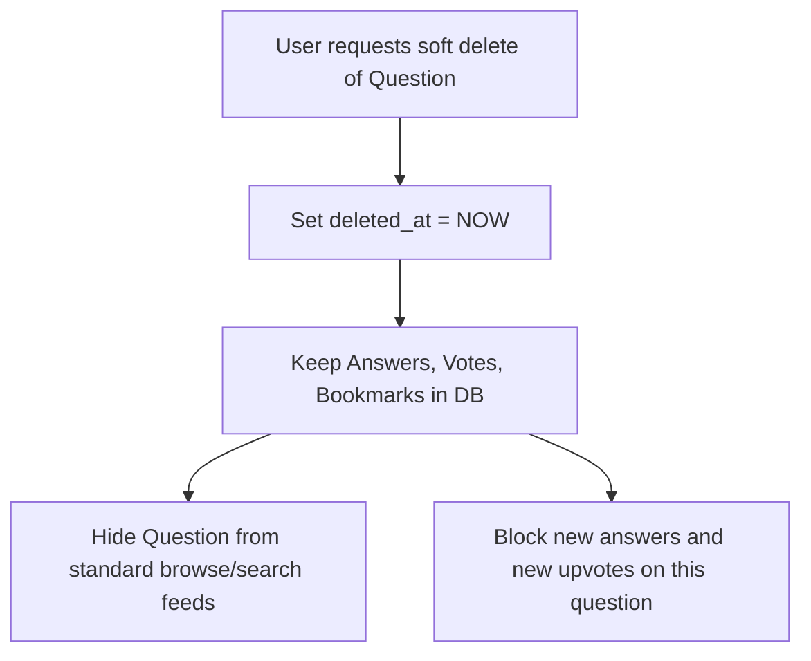

# interQ Business Rules & Edge Case Specifications

This document defines the strict logical behavior, authorization matrix, validation schemas, security requirements, and lifecycle rules of the **interQ** application.

---

## 1. Role-Based Access Control (RBAC) Matrix

| Action | Guest | Authenticated User | Admin |
| :--- | :---: | :---: | :---: |
| Browse / Search Questions & Companies | ✅ | ✅ | ✅ |
| View Question Solutions / Answers | ❌ | ✅ | ✅ |
| Validate Questions ("I was asked this") | ❌ | ✅ | ✅ |
| Upvote Solutions | ❌ | ✅ | ✅ |
| Bookmark Questions | ❌ | ✅ | ✅ |
| Post new Questions & Answers | ❌ | ✅ | ✅ |
| Edit / Delete Own Content | ❌ | ✅ | ✅ |
| Merge Duplicate Questions | ❌ | ❌ | ✅ |
| Moderate Reported Content (Global Delete) | ❌ | ❌ | ✅ |
| Access Telemetry & User Admin Panels | ❌ | ❌ | ✅ |

---

## 2. Core Feature Rules

### 2.1 Authentication & Authorization Rules
1. **Token Verification**: Every authenticated request must pass a Firebase IdToken via the `Authorization: Bearer <token>` header. The token is verified server-side.
2. **Session Hijacking Guard**: The server decodes the Firebase token's expiration (`exp`), matching it against current epoch. Expired tokens yield a `401 Unauthorized` status immediately.
3. **Role Elevation Protection**: A user's role is determined by PostgreSQL record lookup, *not* custom claims inside Firebase (unless verified against PostgreSQL). Only database records control admin permissions.

### 2.2 Question Rules
1. **Creation**: Authenticated users can post questions. A question must link to an existing `Company`, specify a valid `Job Title`, `Interview Round`, `Difficulty`, and `Asked Year`.
2. **Asked Year Bounds**: The `asked_year` must be within the range `[2000, current_year + 1]`.
3. **No Anonymous Posting**: Every question must be associated with a valid `user_id`.
4. **Ownership Policy**: Users can only edit or delete questions they created, unless they have the `admin` role.

### 2.3 Answer / Solution Rules
1. **Markdown Formatting**: Answers support GitHub Flavored Markdown (GFM). Scripts (`<script>`) and iframe tags must be fully stripped on the server side using sanitization engines to prevent Cross-Site Scripting (XSS).
2. **Duplicate Answer Guard**: A user can submit only one answer per question to prevent thread spamming. To submit a new approach, they must edit their existing answer.

### 2.4 Voting Rules
1. **Positive Upvoting Only**: Users can upvote answers. Downvoting is omitted to promote positive developer cooperation.
2. **Self-Voting Prohibition**: Users cannot upvote their own answers. Attempts yield a `403 Forbidden` response.
3. **Toggle Behavior**: Clicking the upvote action again retracts the vote (deletes the record in `votes` table).

### 2.5 "I Was Asked This" (Validation Match) Rules
1. **Purpose**: Tracks how frequently a question is asked in the real world.
2. **Self-Validation Allowed**: Unlike votes, authors *can* validate that they were asked the question themselves.
3. **Uniqueness**: A user can validate a specific question only once. Repeating the action toggle retracts the validation match.

### 2.6 Duplicate Question Detection Rules
1. **Similarity Bounds**: Prior to question submission, a trigram similarity calculation runs on the title.
2. **Trigger Limit**: If title similarity matches an existing active question at the *same company* by **>= 65%**, a warning prompt highlights the matches.
3. **Bypass Option**: Authenticated users can bypass the warning and submit anyway. Administrators can clean and merge these duplicates later.

---

## 3. Lifecycle & Edge Case Behaviors

This section defines the cascade patterns and recovery rules when objects are modified, deleted, or merged.

### 3.1 What happens when a user deletes a Question?
1. **Cascade Prevention**: We never delete database rows from the `questions` table directly. We set `deleted_at = NOW()`.
2. **Feeds**: The question is hidden from public lists, company profile detail feeds, search indexes, and active lists.
3. **Answers & Votes**: Child answers and votes remain intact in the database for auditing and reputation conservation. However, the details page `/questions/[id]` blocks any new answers, edits, or upvoting.
4. **Bookmarks**: Bookmarks pointing to this question remain in database but are filtered out of the user's dashboard view.

### 3.2 What happens when a user deletes an Answer?
1. **Action**: The answer has its `deleted_at` field set to `NOW()`.
2. **Hiding**: It is removed from the question's details thread.
3. **Votes & Reputation**: The upvotes cast on this answer are preserved in the DB, but their count is subtracted from the author's reputation index.

### 3.3 What happens when an Admin merges Duplicate Questions?
When Admin merges Question B (Duplicate) into Question A (Original Master):
1. **Data Transfer**:
   - All `asked_matches` validations pointing to Question B are updated to point to Question A. Duplicate user validations are merged (retaining the earliest timestamp).
   - All `bookmarks` pointing to Question B are updated to point to Question A. Duplicate user bookmarks are collapsed.
   - All `answers` submitted to Question B are updated with `question_id = Question A's ID`.
2. **Redirection**: Question B is soft-deleted (`deleted_at = NOW()`). Any request to `/questions/QuestionB_ID` redirects via permanent redirect (`308 Permanent Redirect`) to `/questions/QuestionA_ID`.
3. **Audit Logging**: A new log is written to `moderation_logs` mapping the action: `{"action": "merge", "from": "B", "to": "A", "admin_id": "..."}`.

### 3.4 What happens when a User Account is deleted?
1. **Firebase Sync**: When an account is removed from Firebase Auth, a webhook updates the PostgreSQL `users` table, setting `deleted_at = NOW()`.
2. **Attribution**: The user's name is set to "Former Member" or "Anonymous User". All their posted questions and answers remain online to preserve community knowledge.
3. **Reputation**: The user's reputation is frozen at 0.

---

## 4. Operational & Security Rules

### 4.1 Rate Limiting Rules
Implemented via Redis key-value window counters:
- **Public endpoints (Search, List Questions)**: 60 requests per minute per IP address.
- **Authenticated write actions (Ask, Answer, Upvote)**: 10 requests per minute per User ID.
- **Authentication endpoints (Login, Register, Forgot Password)**: 5 requests per minute per IP address.
- Exceeding the limits yields a `429 Too Many Requests` status.

### 4.2 Content Sanitization (Markdown & HTML Protection)
- Users submit solutions in Markdown. To prevent Cross-Site Scripting (XSS):
  - Every answer content block must be sanitized server-side on both **write** (upon submission) and **read** (before JSON serialization).
  - Only clean, safe elements (e.g. headers, bold, list structures, pre/code tags, standard anchor tags without javascript targets) are allowed. Script injection attempts are completely dropped.

### 4.3 SEO Optimization Rules
1. **Sitemap Generation**: Dynamic sitemaps `/sitemap.xml` regenerate every 24 hours via cron jobs to index newly created questions and company details.
2. **Header Metadata**:
   - Company detail pages: title="Google Software Engineer Interview Questions | interQ", description="Browse difficulty rankings, interview details, and real coding questions asked at Google."
   - Question detail pages: title="[Question Title] | interQ", description="Read answers, technical explanations, and check validation rates for this interview question."
