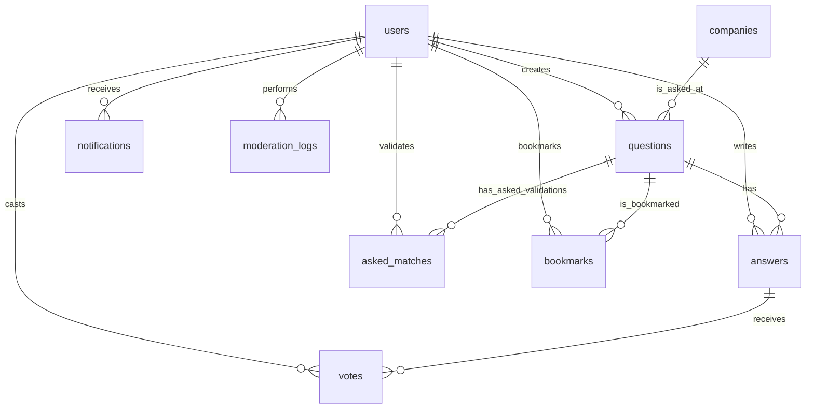
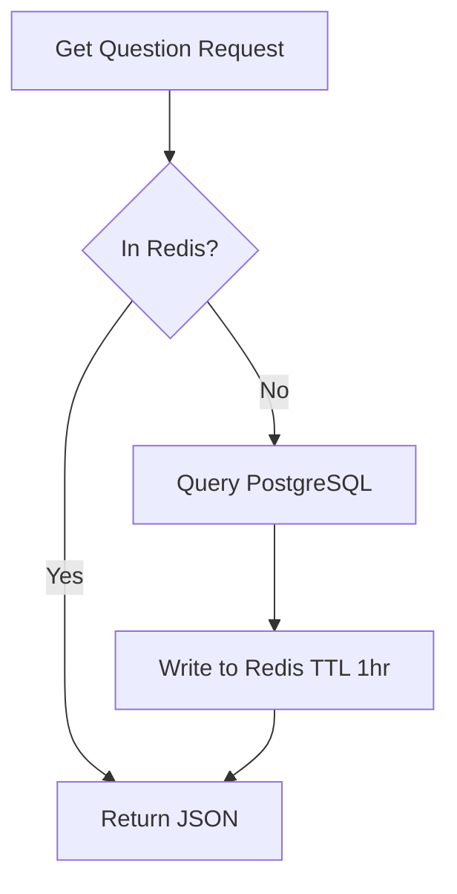
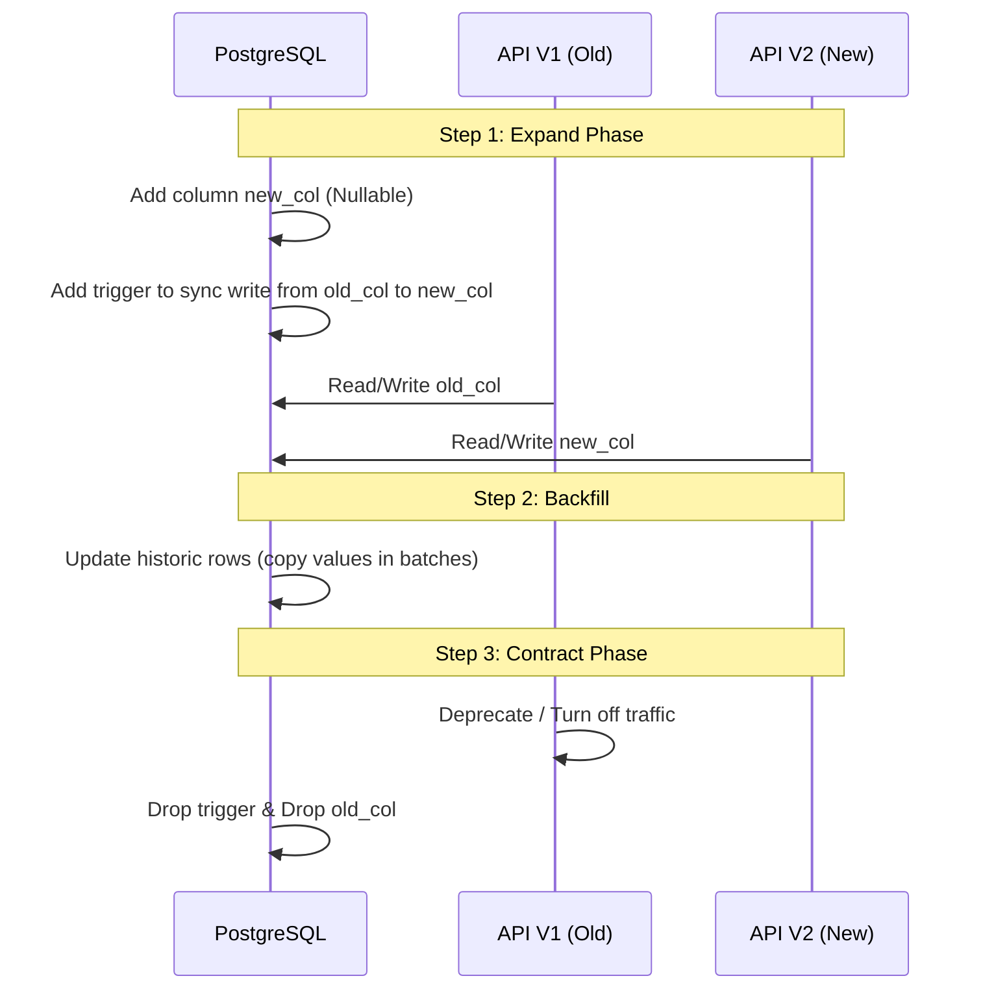

# interQ Database Design Specification

This document defines the production-ready database schema, indexing strategies, caching mechanisms, full-text search layout, and performance policies for the **interQ** platform.

---

## 1. Entity-Relationship Diagram (ERD)



---

## 2. Table Schemas, Columns, Data Types, and Constraints

To map clean TypeScript camelCase structures to optimal PostgreSQL snake_case names, we use Prisma's `@map` and `@@map` directives.

### 2.1 `users` Table
Stores user accounts synchronized from Firebase Authentication.

| Column Name | DB Data Type | Constraints / Keys | Description |
| :--- | :--- | :--- | :--- |
| `id` | `VARCHAR(128)` | PRIMARY KEY | Firebase UID string. |
| `email` | `VARCHAR(255)` | UNIQUE, NOT NULL | User's unique email address. |
| `name` | `VARCHAR(100)` | NOT NULL | Display name. |
| `role` | `VARCHAR(20)` | DEFAULT 'user', CHECK | Role: `user`, `admin`. |
| `avatar_url` | `VARCHAR(512)` | NULLABLE | CDN link to profile image. |
| `bio` | `TEXT` | NULLABLE | User profile biography. |
| `title` | `VARCHAR(100)` | NULLABLE | Job title (e.g., "Senior L6 SWE"). |
| `company` | `VARCHAR(100)` | NULLABLE | Current employing company. |
| `reputation` | `INTEGER` | DEFAULT 0, CHECK | Reputation points >= 0. |
| `created_at` | `TIMESTAMPTZ` | DEFAULT NOW() | Audit: Date user joined. |
| `updated_at` | `TIMESTAMPTZ` | DEFAULT NOW() | Audit: Last profile update. |
| `deleted_at` | `TIMESTAMPTZ` | NULLABLE | Soft delete timestamp. |

*Check Constraints:*
- `role_check`: `role IN ('user', 'admin')`
- `reputation_check`: `reputation >= 0`

---

### 2.2 `companies` Table
Stores profiles of companies where interview questions are asked.

| Column Name | DB Data Type | Constraints / Keys | Description |
| :--- | :--- | :--- | :--- |
| `id` | `UUID` | PRIMARY KEY, DEFAULT gen_random_uuid() | Unique company identifier. |
| `name` | `VARCHAR(100)` | UNIQUE, NOT NULL | Company name (e.g., "Google"). |
| `slug` | `VARCHAR(100)` | UNIQUE, NOT NULL | URL-safe name (e.g., "google"). |
| `logo_url` | `VARCHAR(512)` | NULLABLE | CDN link to company logo. |
| `description`| `TEXT` | NOT NULL | Brief about paragraph. |
| `website` | `VARCHAR(255)` | NOT NULL | Company homepage URL. |
| `industry` | `VARCHAR(100)` | NOT NULL | Industry classification. |
| `location` | `VARCHAR(100)` | NOT NULL | Headquarter location. |
| `employee_count` | `VARCHAR(50)` | NOT NULL | Size bucket (e.g. "10,000+"). |
| `rating` | `DECIMAL(3,2)` | DEFAULT 0.00, CHECK | Interview rating (0.00 to 5.00). |
| `created_at` | `TIMESTAMPTZ` | DEFAULT NOW() | Audit: Entry creation. |
| `updated_at` | `TIMESTAMPTZ` | DEFAULT NOW() | Audit: Entry update. |

*Check Constraints:*
- `rating_check`: `rating >= 0.00 AND rating <= 5.00`

---

### 2.3 `questions` Table
Stores interview questions shared by users.

| Column Name | DB Data Type | Constraints / Keys | Description |
| :--- | :--- | :--- | :--- |
| `id` | `UUID` | PRIMARY KEY, DEFAULT gen_random_uuid() | Unique identifier. |
| `title` | `VARCHAR(255)` | NOT NULL | Headline summarizing the problem. |
| `content` | `TEXT` | NOT NULL | Detailed problem statement / constraints. |
| `role` | `VARCHAR(100)` | NOT NULL | Interviewed role title (e.g., "Staff SWE"). |
| `experience_level` | `VARCHAR(50)` | NOT NULL, CHECK | Level: `entry`, `mid`, `senior`, `staff`. |
| `interview_round` | `VARCHAR(100)` | NOT NULL | Round: `screener`, `coding`, `system_design`. |
| `asked_year` | `SMALLINT` | NOT NULL, CHECK | Year question was asked. |
| `difficulty` | `VARCHAR(20)` | NOT NULL, CHECK | Difficulty: `Easy`, `Medium`, `Hard`. |
| `tags` | `VARCHAR(50)[]` | NOT NULL | Array of topic keywords. |
| `user_id` | `VARCHAR(128)` | FOREIGN KEY -> `users.id` | Author of the question. |
| `company_id` | `UUID` | FOREIGN KEY -> `companies.id` | Company where it was asked. |
| `tsv_search` | `TSVECTOR` | GENERATED | Combined text vector for full-text search. |
| `created_at` | `TIMESTAMPTZ` | DEFAULT NOW() | Audit: Creation. |
| `updated_at` | `TIMESTAMPTZ` | DEFAULT NOW() | Audit: Update. |
| `deleted_at` | `TIMESTAMPTZ` | NULLABLE | Soft delete timestamp. |

*Check Constraints:*
- `difficulty_check`: `difficulty IN ('Easy', 'Medium', 'Hard')`
- `experience_level_check`: `experience_level IN ('entry', 'mid', 'senior', 'staff')`
- `asked_year_check`: `asked_year >= 2000 AND asked_year <= EXTRACT(YEAR FROM CURRENT_DATE) + 1`

---

### 2.4 `answers` Table
Solutions and answers submitted by authenticated users.

| Column Name | DB Data Type | Constraints / Keys | Description |
| :--- | :--- | :--- | :--- |
| `id` | `UUID` | PRIMARY KEY, DEFAULT gen_random_uuid() | Unique answer identifier. |
| `content` | `TEXT` | NOT NULL | Markdown explanation/code solution. |
| `question_id`| `UUID` | FOREIGN KEY -> `questions.id` | Target question. |
| `user_id` | `VARCHAR(128)` | FOREIGN KEY -> `users.id` | Author of the answer. |
| `is_accepted`| `BOOLEAN` | DEFAULT FALSE | Marked accepted by admin or voting threshold. |
| `created_at` | `TIMESTAMPTZ` | DEFAULT NOW() | Audit: Creation. |
| `updated_at` | `TIMESTAMPTZ` | DEFAULT NOW() | Audit: Update. |
| `deleted_at` | `TIMESTAMPTZ` | NULLABLE | Soft delete timestamp. |

---

### 2.5 `votes` Table
Tracks upvotes for answers. Downvotes are omitted to encourage positive community behavior.

| Column Name | DB Data Type | Constraints / Keys | Description |
| :--- | :--- | :--- | :--- |
| `user_id` | `VARCHAR(128)` | FOREIGN KEY -> `users.id` | User voting. |
| `answer_id` | `UUID` | FOREIGN KEY -> `answers.id` | Target answer. |
| `created_at` | `TIMESTAMPTZ` | DEFAULT NOW() | Audit: Vote time. |

*Constraints:*
- PRIMARY KEY (`user_id`, `answer_id`) (enforces exactly 1 vote per user per answer).

---

### 2.6 `asked_matches` Table
Tracks when other users validate a question ("I was asked this").

| Column Name | DB Data Type | Constraints / Keys | Description |
| :--- | :--- | :--- | :--- |
| `user_id` | `VARCHAR(128)` | FOREIGN KEY -> `users.id` | User validating. |
| `question_id`| `UUID` | FOREIGN KEY -> `questions.id` | Target question. |
| `created_at` | `TIMESTAMPTZ` | DEFAULT NOW() | Audit: Validation time. |

*Constraints:*
- PRIMARY KEY (`user_id`, `question_id`) (enforces exactly 1 validation per user per question).

---

### 2.7 `bookmarks` Table
Questions saved by users to study later.

| Column Name | DB Data Type | Constraints / Keys | Description |
| :--- | :--- | :--- | :--- |
| `user_id` | `VARCHAR(128)` | FOREIGN KEY -> `users.id` | User saving. |
| `question_id`| `UUID` | FOREIGN KEY -> `questions.id` | Target question. |
| `created_at` | `TIMESTAMPTZ` | DEFAULT NOW() | Audit: Bookmark time. |

*Constraints:*
- PRIMARY KEY (`user_id`, `question_id`).

---

### 2.8 `notifications` Table
Real-time alerts for replies, validations, or reputation achievements.

| Column Name | DB Data Type | Constraints / Keys | Description |
| :--- | :--- | :--- | :--- |
| `id` | `UUID` | PRIMARY KEY, DEFAULT gen_random_uuid() | Unique notification ID. |
| `user_id` | `VARCHAR(128)` | FOREIGN KEY -> `users.id` | Recipient. |
| `type` | `VARCHAR(30)` | NOT NULL, CHECK | Type: `upvote`, `answer`, `validation`. |
| `title` | `VARCHAR(150)` | NOT NULL | Notification headline. |
| `message` | `TEXT` | NOT NULL | Notification details text. |
| `link` | `VARCHAR(255)` | NOT NULL | URL to redirect upon click. |
| `read` | `BOOLEAN` | DEFAULT FALSE | Status flag. |
| `created_at` | `TIMESTAMPTZ` | DEFAULT NOW() | Audit: Time generated. |

*Check Constraints:*
- `notification_type_check`: `type IN ('upvote', 'answer', 'validation')`

---

### 2.9 `moderation_logs` Table
Tracks admin actions (deletions, merges, audits).

| Column Name | DB Data Type | Constraints / Keys | Description |
| :--- | :--- | :--- | :--- |
| `id` | `UUID` | PRIMARY KEY, DEFAULT gen_random_uuid() | Log ID. |
| `admin_id` | `VARCHAR(128)` | FOREIGN KEY -> `users.id` | Performing administrator. |
| `action` | `VARCHAR(50)` | NOT NULL | Action (e.g. `merge_questions`, `delete_spam`). |
| `details` | `JSONB` | NOT NULL | Context metadata (old IDs, reason). |
| `created_at` | `TIMESTAMPTZ` | DEFAULT NOW() | Audit: Time. |

---

## 3. Database Indexes

High performance at scale requires precise indexing to avoid sequential scans.

1. **`users` Table**:
   - `idx_users_deleted_at`: Partial index on `deleted_at` where `deleted_at IS NULL`. Speeds up all active user lookups.

2. **`questions` Table**:
   - `idx_questions_company_id`: Speeds up company profile detail views.
   - `idx_questions_user_id`: Speeds up profile list feeds.
   - `idx_questions_difficulty_created_at`: Composite index (`difficulty`, `created_at DESC`) for sidebar filtering.
   - `idx_questions_tsv`: GIN index on `tsv_search` for full-text search.
   - `idx_questions_deleted_at`: Partial index (`deleted_at IS NULL`).

3. **`answers` Table**:
   - `idx_answers_question_id`: Crucial for loading question details threads.
   - `idx_answers_deleted_at`: Partial index (`deleted_at IS NULL`).

4. **`notifications` Table**:
   - `idx_notifications_user_read`: Composite index (`user_id`, `read`) to fetch unread counters.

---

## 4. Normalization & Soft Delete Strategy

### 4.1 Normalization Choice
The database is fully normalized to **Third Normal Form (3NF)**:
- All columns depend directly on primary keys.
- Tags are stored as PostgreSQL native array `VARCHAR(50)[]` inside `questions` to balance scalability (no need for a joins table on query performance) with simplicity (easily indexed via GIN).
- Vote counters are not stored as columns. They are calculated dynamically using `COUNT()` aggregates on `votes` and cached in Redis (see Caching).

### 4.2 Soft Delete Strategy
To protect data integrity, questions, answers, and profiles are never deleted from PostgreSQL via `DELETE`. Instead:
- We set `deleted_at = TIMESTAMPTZ`.
- Active queries must include `deleted_at IS NULL`.
- Foreign keys use `ON DELETE RESTRICT` to ensure cascading deletes don't happen automatically.
- Deleted answers are hidden from listings. Deleted questions hide all child answers.

---

## 5. Duplicate Detection & Full-Text Search Strategy

### 5.1 Duplicate Detection Engine
Duplicate prevention uses the **pg_trgm** module:
1. When a user drafts a title: "Implement distributed rate limiter", Next.js hits `/api/questions/duplicate-check?title=...`
2. Postgres calculates trigram similarity:
   ```sql
   SELECT id, title, similarity(title, $1) AS score
   FROM questions
   WHERE similarity(title, $1) > 0.4 AND deleted_at IS NULL
   ORDER BY score DESC
   LIMIT 3;
   ```
3. If similarity exceeds **0.65**, the UI presents a duplicate warning modal.

### 5.2 Full-Text Search
Full-text search is implemented via Postgres **generated tsvector columns**:
- Column `tsv_search` in `questions` table:
  ```sql
  ALTER TABLE questions ADD COLUMN tsv_search tsvector
  GENERATED ALWAYS AS (
    setweight(to_tsvector('english', coalesce(title, '')), 'A') ||
    setweight(to_tsvector('english', coalesce(content, '')), 'B')
  ) STORED;
  ```
- Search queries use `@@` with `websearch_to_tsquery` to support double quotes, logical `AND`/`OR` operators:
  ```sql
  SELECT id, title, ts_rank(tsv_search, query) as rank
  FROM questions, websearch_to_tsquery('english', $1) query
  WHERE tsv_search @@ query AND deleted_at IS NULL
  ORDER BY rank DESC;
  ```

---

## 6. Redis Caching Strategy

We use Redis for low-latency lookups (<2ms) and rate-limiting.



1. **Cache-Aside Pattern (Reads)**:
   - Cache keys: `question:detail:{id}`, `company:detail:{slug}`.
   - TTL: 1 hour (3600s).
   - Write-through invalidation: On `UPDATE` or `soft-delete` of questions, purge the cache key: `DEL question:detail:{id}`.

2. **Upvote / Validation Counters**:
   - Store total count in Redis hash keys: `question:stats:{id}` -> `upvotes_count`, `validations_count`.
   - On upvote: Increment key value and queue a PostgreSQL background flush job.

3. **Rate Limiting**:
   - Key format: `ratelimit:{ip_or_uid}:{endpoint}`.
   - Set expiry with TTL matching duration (e.g. 60s).

---

## 7. Prisma Production Schema

```prisma
datasource db {
  provider = "postgresql"
  url      = env("DATABASE_URL")
}

generator client {
  provider = "prisma-client-js"
}

enum Role {
  user
  admin
}

enum Difficulty {
  Easy
  Medium
  Hard
}

enum ExperienceLevel {
  entry
  mid
  senior
  staff
}

model User {
  id             String          @id @db.VarChar(128)
  email          String          @unique @db.VarChar(255)
  name           String          @db.VarChar(100)
  role           Role            @default(user)
  avatarUrl      String?         @map("avatar_url") @db.VarChar(512)
  bio            String?         @db.Text
  title          String?         @db.VarChar(100)
  company        String?         @db.VarChar(100)
  reputation     Int             @default(0)
  createdAt      DateTime        @default(now()) @map("created_at") @db.Timestamptz
  updatedAt      DateTime        @updatedAt @map("updated_at") @db.Timestamptz
  deletedAt      DateTime?       @map("deleted_at") @db.Timestamptz

  questions      Question[]
  answers        Answer[]
  votes          Vote[]
  askedMatches   AskedMatch[]
  bookmarks      Bookmark[]
  notifications  Notification[]
  moderationLogs ModerationLog[]

  @@map("users")
}

model Company {
  id                 String     @id @default(dbgenerated("gen_random_uuid()")) @db.Uuid
  name               String     @unique @db.VarChar(100)
  slug               String     @unique @db.VarChar(100)
  logoUrl            String?    @map("logo_url") @db.VarChar(512)
  description        String     @db.Text
  website            String     @db.VarChar(255)
  industry           String     @db.VarChar(100)
  location           String     @db.VarChar(100)
  employeeCount      String     @map("employee_count") @db.VarChar(50)
  rating             Decimal    @default(0.00) @db.Decimal(3, 2)
  createdAt          DateTime   @default(now()) @map("created_at") @db.Timestamptz
  updatedAt          DateTime   @updatedAt @map("updated_at") @db.Timestamptz

  questions          Question[]

  @@map("companies")
}

model Question {
  id              String          @id @default(dbgenerated("gen_random_uuid()")) @db.Uuid
  title           String          @db.VarChar(255)
  content         String          @db.Text
  role            String          @db.VarChar(100)
  experienceLevel ExperienceLevel @map("experience_level")
  interviewRound  String          @map("interview_round") @db.VarChar(100)
  askedYear       Int             @map("asked_year") @db.SmallInt
  difficulty      Difficulty
  tags            String[]        @db.VarChar(50)
  userId          String          @map("user_id") @db.VarChar(128)
  companyId       String          @map("company_id") @db.Uuid
  createdAt       DateTime        @default(now()) @map("created_at") @db.Timestamptz
  updatedAt       DateTime        @updatedAt @map("updated_at") @db.Timestamptz
  deletedAt       DateTime?       @map("deleted_at") @db.Timestamptz

  user            User            @relation(fields: [userId], references: [id], onDelete: Restrict)
  company         Company         @relation(fields: [companyId], references: [id], onDelete: Restrict)
  answers         Answer[]
  askedMatches    AskedMatch[]
  bookmarks       Bookmark[]

  @@map("questions")
}

model Answer {
  id         String    @id @default(dbgenerated("gen_random_uuid()")) @db.Uuid
  content    String    @db.Text
  questionId String    @map("question_id") @db.Uuid
  userId     String    @map("user_id") @db.VarChar(128)
  isAccepted Boolean   @default(false) @map("is_accepted")
  createdAt  DateTime  @default(now()) @map("created_at") @db.Timestamptz
  updatedAt  DateTime  @updatedAt @map("updated_at") @db.Timestamptz
  deletedAt  DateTime? @map("deleted_at") @db.Timestamptz

  question   Question  @relation(fields: [questionId], references: [id], onDelete: Restrict)
  user       User      @relation(fields: [userId], references: [id], onDelete: Restrict)
  votes      Vote[]

  @@map("answers")
}

model Vote {
  userId    String   @map("user_id") @db.VarChar(128)
  answerId  String   @map("answer_id") @db.Uuid
  createdAt DateTime @default(now()) @map("created_at") @db.Timestamptz

  user      User     @relation(fields: [userId], references: [id], onDelete: Cascade)
  answer    Answer   @relation(fields: [answerId], references: [id], onDelete: Cascade)

  @@id([userId, answerId])
  @@map("votes")
}

model AskedMatch {
  userId     String   @map("user_id") @db.VarChar(128)
  questionId String   @map("question_id") @db.Uuid
  createdAt  DateTime @default(now()) @map("created_at") @db.Timestamptz

  user       User     @relation(fields: [userId], references: [id], onDelete: Cascade)
  question   Question @relation(fields: [questionId], references: [id], onDelete: Cascade)

  @@id([userId, questionId])
  @@map("asked_matches")
}

model Bookmark {
  userId     String   @map("user_id") @db.VarChar(128)
  questionId String   @map("question_id") @db.Uuid
  createdAt  DateTime @default(now()) @map("created_at") @db.Timestamptz

  user       User     @relation(fields: [userId], references: [id], onDelete: Cascade)
  question   Question @relation(fields: [questionId], references: [id], onDelete: Cascade)

  @@id([userId, questionId])
  @@map("bookmarks")
}

model Notification {
  id        String   @id @default(dbgenerated("gen_random_uuid()")) @db.Uuid
  userId    String   @map("user_id") @db.VarChar(128)
  type      String   @db.VarChar(30)
  title     String   @db.VarChar(150)
  message   String   @db.Text
  link      String   @db.VarChar(255)
  read      Boolean  @default(false)
  createdAt DateTime @default(now()) @map("created_at") @db.Timestamptz

  user      User     @relation(fields: [userId], references: [id], onDelete: Cascade)

  @@map("notifications")
}

model ModerationLog {
  id        String   @id @default(dbgenerated("gen_random_uuid()")) @db.Uuid
  adminId   String   @map("admin_id") @db.VarChar(128)
  action    String   @db.VarChar(50)
  details   Json     @db.Jsonb
  createdAt DateTime @default(now()) @map("created_at") @db.Timestamptz

  admin     User     @relation(fields: [adminId], references: [id], onDelete: Restrict)

  @@map("moderation_logs")
}
```

---

## 8. Zero-Downtime Migration Strategy

Deployments of schema modifications must follow the **Expand and Contract** pattern to support concurrent operation of two API versions during updates.



1. **Schema Expansion**: Add new tables or nullable columns to the live database. Deploy API code capable of writing to both old and new layouts.
2. **Data Sync & Backfilling**: Execute background batch tasks using utility scripts to copy legacy data to the new format in blocks of 5,000 records.
3. **Cutover & Contraction**: Point all API traffic to the new version. Once verified, run a schema migration to drop obsolete fields and triggers.
